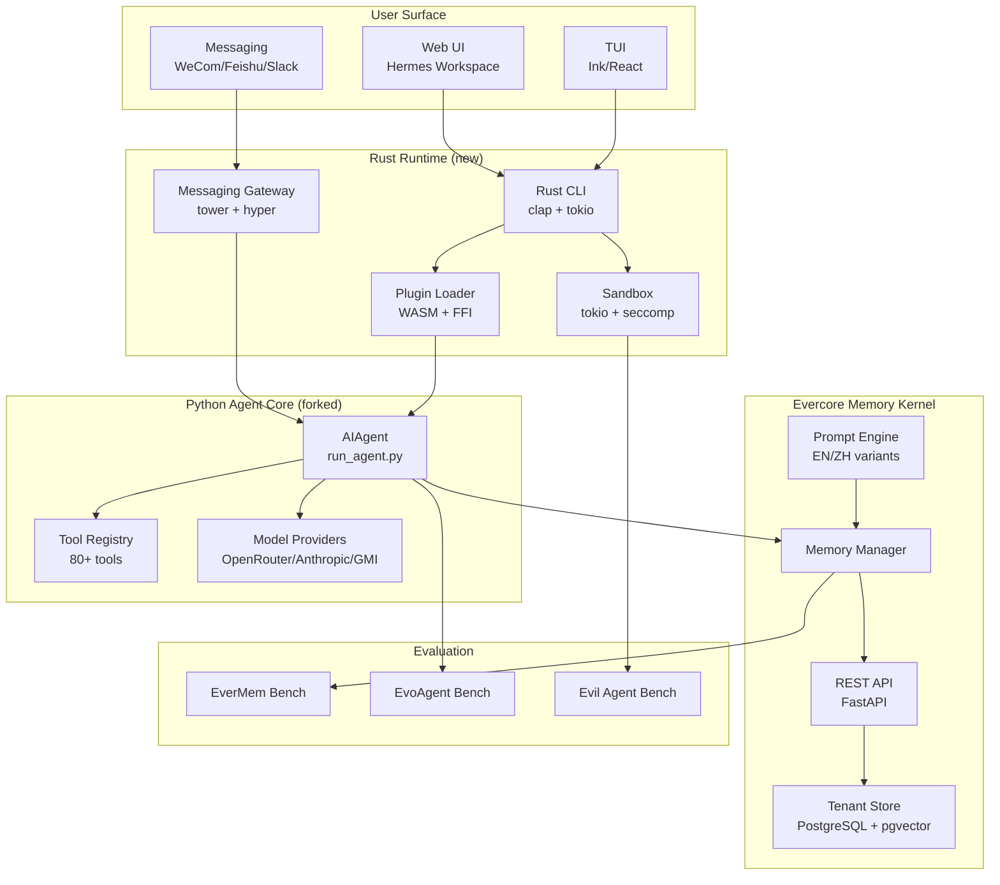
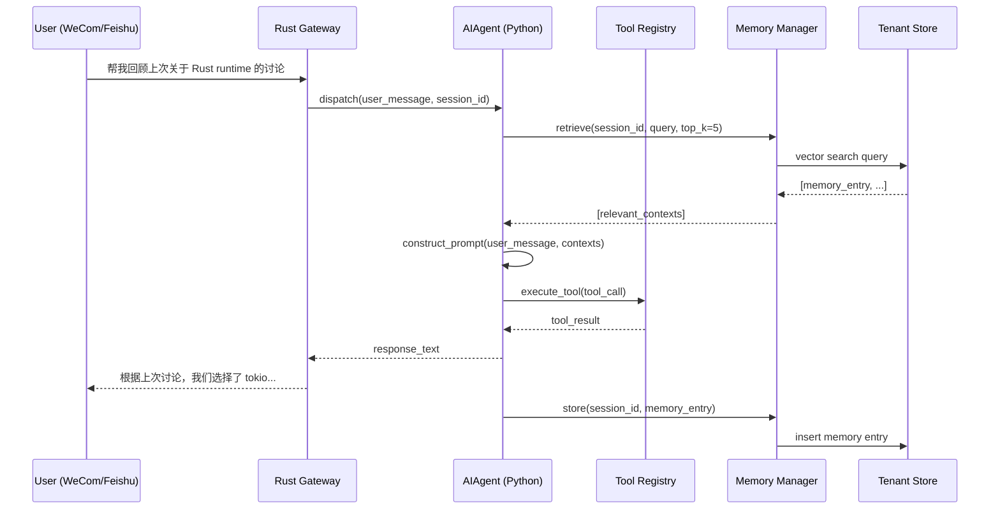

# 10 — Architecture: May Agent System Design

**Status**: Draft
**Date**: 2026-05-13
**Depends on**: 00-vision.md, hermes-recon/architecture.md

## System Overview



## Component Architecture

### Layer 1: Rust Runtime

```
may-agent/
├── may-agent-cli/        # CLI binary (clap)
├── may-agent-runtime/    # Core runtime (tokio)
│   ├── plugin-loader/    # WASM + FFI plugin host
│   ├── sandbox/          # Process sandbox (seccomp-bpf on Linux)
│   ├── gateway/          # Messaging gateway (tower services)
│   └── config/           # Config loading (figment/serde)
├── may-agent-ffi/        # Python ↔ Rust FFI (PyO3)
├── may-agent-desktop/    # Tauri desktop shell
└── may-agent-mobile/     # Mobile FFI stubs (future)
```

### Layer 2: Python Agent Core (forked from Hermes)

- `run_agent.py` — AIAgent class (forked, ~12K LOC)
- `model_tools.py` — tool orchestration (forked)
- `tools/` — 80+ tool modules (forked, auto-discovered via registry)
- `plugins/model-providers/` — inference backends (forked)
- `plugins/context_engine/` — context augmentation (extended with Evercore)

### Layer 3: Evercore Memory Kernel

- `memory_manager.py` — core memory operations (tenant-scoped)
- REST API controllers — CRUD for memory entries (`src/infra_layer/adapters/input/api/`)
- Prompt engine — bilingual EN/ZH prompt variants (`src/memory_layer/prompts/`)
- Tenant storage — PostgreSQL + pgvector (EverCore infrastructure)

## Data Flow



## Decision Matrix

### Runtime Language

| Criterion | Python (fork only) | Rust + Python (hybrid) | Pure Rust |
|-----------|-------------------|----------------------|-----------|
| Dev speed | Fast (existing code) | Medium (FFI glue) | Slow (rewrite all) |
| Memory safety | GIL only | Seccomp + type safety | Type safety everywhere |
| Binary size | ~200MB (venv) | ~50MB (Rust + Python embed) | ~20MB |
| Team familiarity | High (Python-first team) | Mixed (Nolan + 七仔) | Low (team Python-native) |
| Sandbox quality | Docker-based | Seccomp-bpf (kernel) | Full control |
| May 31 viability | Ships | Ships (MVP) | Too slow |
| **Verdict** | — | ✅ **Chosen** | — |

### Memory Backend

| Criterion | Honcho (Hermes default) | mem0 | Evercore |
|-----------|------------------------|------|----------|
| Multi-tenant | No | No | Yes (built-in) |
| Long-term recall | Basic | Vector only | Prompt-optimized |
| EN/ZH prompts | No | No | Yes (bilingual) |
| Benchmarked | No | No | Yes (EverMem + EvoAgent) |
| Integration effort | 0 (already works) | Low (plugin exists) | Medium (FFI + API) |
| **Verdict** | — | — | ✅ **Chosen** |

### Sandbox Strategy

| Criterion | Docker | Seccomp-bpf (Rust) | macOS Seatbelt |
|-----------|--------|-------------------|----------------|
| Isolation quality | Good (container) | Best (syscall filter) | Good (kernel) |
| Cross-platform | Yes | Linux only | macOS only |
| Performance | ~200ms cold | ~5ms cold | ~5ms cold |
| Implementation | Existing (Hermes env) | New (tokio + libseccomp) | New (native sandbox_init) |
| **Verdict** | Fallback | ✅ **Primary** | Desktop only |

### Messaging Gateway

| Platform | Effort | Priority | Rationale |
|----------|--------|----------|-----------|
| WeCom (企业微信) | Medium | P0 | Chinese enterprise #1 |
| Feishu (飞书) | Medium | P0 | Chinese enterprise #2 |
| Slack | Low | P1 | International + internal use |
| Discord | Low | P1 | Community + Nolan's inter-PR |
| Tanka | High | P2 | New platform, less mature API |
| Telegram | Low | P3 | International fallback |

## Crate Dependencies (Rust)

```toml
# may-agent-runtime/Cargo.toml (proposed)
[dependencies]
tokio = { version = "1", features = ["full"] }
pyo3 = { version = "0.22", features = ["extension-module"] }
serde = { version = "1", features = ["derive"] }
serde_json = "1"
clap = { version = "4", features = ["derive"] }
tower = "0.4"
hyper = "1"
figment = { version = "0.10", features = ["toml", "env"] }
tracing = "0.1"
tracing-subscriber = "0.3"

[target.'cfg(target_os = "linux")'.dependencies]
libseccomp = "0.3"

[target.'cfg(target_os = "macos")'.dependencies]
# macOS Seatbelt via sandbox_init (libsystem)
```

## Component Specification

### Rust CLI

```rust
// Proposed CLI structure using clap derive
#[derive(Parser)]
enum Command {
    /// Start interactive agent session
    Run { config: PathBuf },
    /// Start messaging gateway
    Gateway { config: PathBuf, platform: String },
    /// Start MCP server
    Mcp { config: PathBuf },
    /// Manage plugins
    Plugin { subcommand: PluginCmd },
}
```

### Python-Rust FFI Bridge

Key function signatures for PyO3 bridge:

```rust
// Rust side: Python-callable functions
#[pyfunction]
fn tool_dispatch(tool_name: &str, params: &str) -> PyResult<String>;

#[pyfunction]
fn sandbox_run(command: &str, env_vars: HashMap<String, String>) -> PyResult<RunResult>;

#[pyfunction]
fn gateway_deliver(platform: &str, chat_id: &str, message: &str) -> PyResult<()>;
```

### Memory Bridge

The memory bridge connects the Rust runtime to Evercore's Python API:

```
Rust Gateway → POST /api/v1/memory/retrieve
              POST /api/v1/memory/store
              GET  /api/v1/memory/session/{id}
```

Wire format: JSON, same schema as EverCore REST API controllers.
See `30-evercore-integration-contract.md` for full API contract.

## Prior Art Analysis

| Project | Language | Sandbox | Memory | License | Stars |
|---------|----------|---------|--------|---------|-------|
| Hermes Agent | Python | Docker/SSH | Pluggable (8 backends) | MIT | 147k |
| OpenClaw | TypeScript | Docker | Built-in | Proprietary | — |
| gbrain | TypeScript | Docker | Opinionated Hermes | MIT | 15k |
| Claude Code | TS + Native | macOS Seatbelt | Built-in | Proprietary | — |
| **May Agent** | **Rust + Python** | **Seccomp + Docker** | **Evercore** | **MIT (fork)** | **TBD** |

## Integration Contract Outline

See `30-evercore-integration-contract.md` for full specification. Key interfaces:

1. **Memory API**: `retrieve(session_id, query, top_k) → [MemoryEntry]`, `store(session_id, entry) → MemoryId`
2. **Session API**: `create_session(tenant_id, config) → SessionId`, `get_session(session_id) → Session`
3. **Tool Proxy API**: `dispatch_tool(tool_name, params) → ToolResult` (optional — for sandboxed tool execution)
4. **Health API**: `GET /health → {status, version, tenants_active}`

## References

- 00-vision.md — strategy and success criteria
- hermes-recon/architecture.md — Hermes agent internals
- `methods/EverCore/src/agentic_layer/memory_manager.py` — core memory manager
- `methods/EverCore/src/infra_layer/adapters/input/api/` — REST API controllers
- Claude Desktop sandbox forensics: `CLAUDE_DESKTOP_SANDBOX_SOURCE_TRUTH.md`
- Tauri: https://tauri.app (desktop shell reference)
- tokio: https://tokio.rs (async runtime reference)
- Hermes upstream: `NousResearch/hermes-agent` (SHA: HEAD 2026-05-13)
