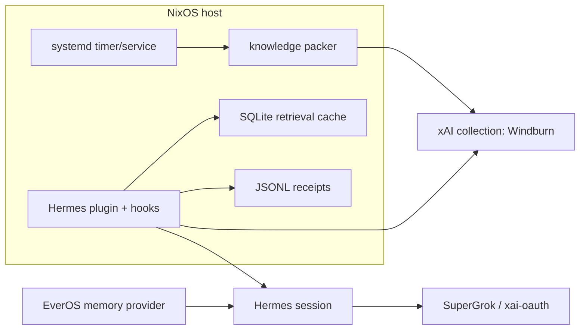

# Hermes SuperGrok on NixOS: Three Auth Planes

## Status
Draft design, approved at the architecture level.

## Context
Hermes now supports `xai-oauth`, and the local session shows a successful SuperGrok login with `model.provider=xai-oauth` and default model `grok-4.3`.

At the same time, the remote NixOS path needs the sanitized repository knowledge bundle that was already prepared for the `Windburn` xAI collection. That bundle is not the same thing as the interactive chat session: it is a durable knowledge corpus that must be refreshable on a remote host.

This design keeps those concerns separate:

1. Hermes session auth for interactive model turns.
2. xAI collection auth for knowledge upload and refresh.
3. NixOS host auth for scheduling, file ownership, and deployment control.

## Goals

- Use SuperGrok OAuth only for Hermes model sessions.
- Keep xAI collection management credentials out of the Hermes session context.
- Make the knowledge corpus reproducible and incrementally refreshable on NixOS.
- Inject retrieved knowledge into Hermes through hooks and tool boundaries, not through ad hoc prompt stuffing.
- Support both scheduled and manual sync on the remote host.
- Keep raw tokens, private paths, and host details out of model-visible context and receipts.

## Non-Goals

- Replacing the existing EverOS memory provider.
- Making the browser part of the steady-state auth path.
- Mirroring every repo file into xAI.
- Letting model output mutate the knowledge corpus directly.
- Sharing one secret across the session, collection, and host planes.

## Decision

The recommended implementation is a host-owned sync service on NixOS plus a Hermes plugin/hook layer:

- Hermes uses `xai-oauth` for chat and model calls.
- A separate NixOS service uses a collection-scoped xAI management key to build and refresh the knowledge bundle.
- A Hermes plugin uses collection search plus local cache to retrieve relevant snippets before a turn.
- Hermes hooks redact, gate, and record tool activity.
- `execute_code` is allowed only for mechanical packaging and validation work, not for auth-sensitive calls.

This gives one clean operator flow on NixOS without turning OAuth into a universal credential.

## Architecture

## Components

### 1. Hermes session plane

Hermes runs with `xai-oauth` as the model provider. The OAuth state stays in Hermes-managed auth state, not in the knowledge bundle and not in the xAI collection sync service.

This plane is only for interactive turns and tool orchestration. It must not be used as a transport for collection management keys.

### 2. Knowledge sync plane

The NixOS host owns a dedicated sync service and timer. The service:

- reads the sanitized knowledge source set,
- builds a manifest and bundle hash,
- uploads or refreshes the `Windburn` collection,
- writes an audit receipt,
- marks the corpus stale or healthy.

The sync service uses a collection-scoped xAI management key that lives in a host secret file wired in as the unit's `EnvironmentFile`. The key is readable by the sync unit only.

The bundle itself is the reproducible artifact. It should contain the same repo knowledge corpus that was already prepared for xAI, plus enough metadata to make incremental updates safe:

- source roots
- doc list
- checksums
- sanitization timestamp
- bundle hash
- upload time

### 3. NixOS control plane

NixOS controls when sync runs, where the bundle lives, and which service user owns the artifacts. The host may trigger sync in two ways:

- a `systemd timer` for steady-state refresh
- a manual `systemctl start` / operator-triggered run for catch-up or re-upload

The timer is the default path and should refresh on an hourly cadence unless host config overrides it. Manual runs use the same service so the behavior stays identical.

## Data Flow

1. The operator logs into Hermes with SuperGrok OAuth.
2. NixOS starts or resumes the sync service on a timer or manual trigger.
3. The packer gathers the approved knowledge sources and produces a sanitized bundle.
4. The sync service uploads the bundle to the existing `Windburn` collection.
5. When Hermes starts a turn, the plugin checks local cache and collection health.
6. If the cache misses or the corpus is stale, the plugin queries the collection.
7. The plugin injects a short, provenance-bearing context block into the next turn.
8. Hooks redact sensitive output and write receipts.
9. If sync fails, Hermes keeps working with the last known corpus or with no collection context rather than failing the whole session.

## Auth Boundaries

- SuperGrok OAuth may authenticate the Hermes session, but it never authenticates collection writes.
- The collection management key may upload and refresh the collection, but it never authenticates Hermes chat.
- Host control credentials may start and supervise the service, but they never enter the model context.
- No plane should read the others’ secret material unless a wrapper explicitly resolves it inside the trusted host process.

## Caching and Context Retrieval

The design uses two caches:

- a short-lived SQLite retrieval cache for collection search results
- Hermes conversation caching via the existing `x-grok-conv-id` behavior when xAI transport is in use

Cache keys should include the collection name, bundle hash, normalized query hash, top_k, and stable filter serialization. That makes invalidation straightforward when the corpus changes and keeps repeated turns on the same bundle at `O(1)` average cache lookup cost.

Context retrieval should stay small and focused:

- top-k snippets only
- provenance on every snippet
- no raw documents unless a user explicitly asks
- no private paths or token material in the injected text

The EverOS memory provider remains the durable local turn-memory layer. The xAI collection is a separate knowledge corpus, not a replacement for local memory.

## Sync Algorithm

The NixOS sync job should be content-addressed instead of rebuild-everything:

- normalize the approved source root list once
- walk the source tree once
- ignore generated outputs and public-surface junk
- hash each source document after sanitization
- store a manifest row per document path with its content hash and upload state
- diff the new manifest against the last successful manifest with a path -> hash map
- upload only the added or changed documents in stable path order
- mark deletions as tombstones in the manifest so the next run can reconcile them safely
- publish the new manifest pointer only after the upload succeeds

That keeps the first run at `O(N)` but makes incremental refreshes proportional to the changed set, `O(Δ)`, instead of resending the entire corpus.

If the plugin merges multiple candidate sources at read time, it should keep only the best `K` results in a bounded min-heap rather than sorting the full candidate list. That keeps the merge step at `O(M log K)` instead of `O(M log M)`.

## Hooks and Sandbox

Use Hermes hooks for policy, not business logic:

- `pre_tool_call` blocks dangerous or mis-scoped tool calls.
- `pre_llm_call` injects retrieved knowledge and current health state.
- `transform_tool_result` redacts secrets, paths, and oversized outputs before they reach the model.
- `post_tool_call` records a receipt with tool name, duration, status, and collection revision.

Use `execute_code` only for mechanical work such as bundle generation, manifest checks, mock uploads, and offline validation. It should not hold raw collection secrets or perform browser-based auth.

If a future implementation wants a sandboxed helper for packaging, that helper must read secrets only from trusted host files and must never echo them to stdout or into the model context.

## Error Handling

- If Hermes OAuth expires, the session should fail closed and ask for re-authentication.
- If the xAI sync key is missing, the sync service should stop before any upload attempt.
- If upload fails mid-run, the bundle should be marked stale and the previous healthy corpus should remain usable.
- If retrieval fails, Hermes should continue with the EverOS memory provider or no external collection context.
- If a receipt write fails, the turn may continue, but the sync service must surface a visible health warning so the host does not silently drift.

## Testing

The implementation should prove each plane independently:

- session smoke: Hermes can log into xAI with SuperGrok OAuth and start a turn
- sync smoke: the NixOS service can build, upload, and refresh the `Windburn` collection
- cache smoke: repeated queries hit the local retrieval cache when the bundle hash is unchanged
- delta smoke: an unchanged source tree produces a no-op manifest diff and skips upload
- top-k smoke: merged candidates preserve only the strongest `K` results without a full resort
- hook smoke: secret/path redaction works before model-visible output
- failure smoke: missing secrets, expired auth, and retrieval timeouts degrade cleanly

The existing repo already has good patterns for this style of proof:

- local provider load and smoke commands in `use-cases/hermes-everos-memory`
- remote health and full smoke patterns for the NixOS service
- packet-based receipts for Raven / Hermes / EverOS work

## Rollout

1. Confirm the Hermes xAI OAuth session works on the target NixOS host.
2. Add the knowledge sync service and timer.
3. Wire the retrieval plugin and hooks.
4. Add cache and receipt files.
5. Run the session, sync, cache, delta, top-k, and failure smokes.
6. Treat the remote lane as `PASS` only when the auth planes stay separated and the knowledge corpus can be refreshed again without reworking the architecture.

## Success Criteria

- Hermes uses SuperGrok OAuth for model turns on NixOS.
- The remote host can refresh the xAI knowledge corpus without exposing the management key to the session.
- Incremental refreshes reuse the manifest diff path when the source tree is unchanged.
- Retrieved knowledge enters the prompt through hooks, not ad hoc manual copy/paste.
- The system continues to function when sync is stale or temporarily unavailable.
- The design stays compatible with the existing EverOS memory provider and remote EverCore packet.
